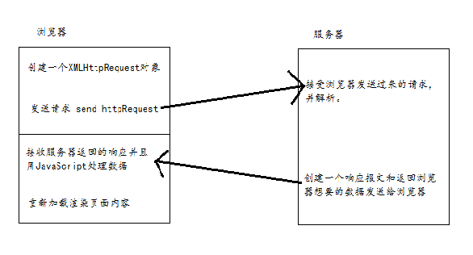

# AJAX

> AJAX 是一种在无需重新加载整个网页的情况下，能够更新部分网页的技术。
***

## 1.什么是 AJAX ？

AJAX = Asynchronous JavaScript and XML（异步 javascript 和 xml ）。
AJAX 是一种用于创建快速动态网页的技术。
通过在后台与服务器进行少量的数据交换，AJAX 可以使网页实现异步更新。这意味着可以在不加载整个页面的情况下，对网页的某个部分进行更新。
传统的网页（不使用AJAX）如果需要更新内容，需要重载整个页面。
***

## 2.AJAX 工作原理


***

## 3.AJAX 是基于现有的Internet标准

* XMLHttpRequest对象（异步的与服务器交换数据)
* JavaScript/DOM（信息显示/交互）
* CSS（给数据定义样式）
* XML/JSON（作为转换数据的格式）
***

## 4.创建XMLHttpRequest对象

> XMLHttpRequest对象是AJAX的基础

### 4.1.XMLHttpRequest对象

所有现代的浏览器都支持XMLHttpRequest对象（IE5和IE6使用ActiveXObject）。

### 4.2.创建XMLHttpRequest对象

所有现代的浏览器内创建XMLHttpRequest对象的语法：
`var xml=new XMLHttpRequest();`
老版本的IE（IE5和IE6）使用ActiveXObject对象的语法：
`var xml=new ActiveXObject("Microsoft.XMLHTTP");`
为了考虑兼容问题，先检查浏览器是否支持XMLHttpRequest对象。如果支持，则创建XMLHttpRequest对象，如果不支持，则创建ActiveXObject，代码如下：
```
var xml;
if(window.XMLHttpRequest){
    // code for IE7+, Firefox, Chrome, Opera, Safari
    xml=new XMLHttpRequest();
}else{
    // code for IE6, IE5
    xml=new ActiveXObject("Microsoft.XMLHTTP");
}
```
***

## 5.向服务器发送请求

如果需将请求发送到服务器，使用XMLHttpRequest对象的open（）和send（）方法：
```
xml.open("GET","test.php",true);
xml.send();
```
### 5.1.open方法

语法：open(method,url,async)，规定请求的类型、URL以及是否异步处理请求。
* method：请求的类型；GET或者POST
* URL：发送到服务器处理请求的位置
* async：true（异步）或者false（同步）

### 5.2.send方法

语法：send（string），将请求发送到服务器。
* string：仅用于POST请求

### 5.3.GET和POST

与POST相比，GET更简单也更快，并且在大部分情况下都能用。
在以下情况中，使用POST请求：
* 无法使用缓存文件（更新服务器上的文件或数据库）
* 向服务器发送大量的数据（POST没有数据量限制）
* 发送包含未知字符的用户输入时，POST比GET更稳定也更可靠

get和post在http中在数据大小都是没有限制的, 但是浏览器和服务器都对url长度有限制, 而get是把数据放到url中的, 所以get就有个限制了, 在浏览器端和服务器端都有限制, ie最少为2083个,chrome是8k多个字符, 超过就不对(实际遇到过), 服务器端也有限制,apache是限制8k多个字符, 如果是浏览器用, 最好不要超过2083个字符, 如果是接口那么限制就在服务器端了, 具体多少看服务器的配置, 为什么服务器端要限制呢?因为url太长了对并发处理会下降post理论上来说没有限制, 但是实际中服务器是有限制的, php的话在post_max_size(php.ini)中设置, 默认为8M

### 5.4.setRequestHeader方法

如果需要发送POST数据，需要使用setRequestHeader()来添加HTTP头，然后在send()方法中添加你希望发送的数据
语法：setRequestHeader(header,value),向请求添加HTTP头。
* header：规定头的名称 `"Content-type"`
* value：规定头的值 `"application/x-www-form-urlencoded"`

### 5.5.URL-服务器上的文件的地址

该文件可以是任何类型的文件，比.txt和.xml,或者服务器脚本文件，比如.asp和.php（在传回响应之前，能够在服务器上执行任务）。

### 5.6.异步-true或者false

AJAX 指的是异步 JavaScript 和 XML（Asynchronous JavaScript and XML）。
XMLHttpRequest 对象如果要用于 AJAX 的话，其 open() 方法的 async 参数必须设置为 true：
`xml.open("GET","test.php",true);`
对于web开发人员来说，发送异步请求是一个巨大的进步。很多在服务器执行的任务都相当费时。AJAX出现之前，这可能会引起应用程序挂起或停止。
通过AJAX，javascript无需等待服务器的响应，而是在等待服务器响应时执行其他脚本，当响应就绪后对响应进行处理

## 6.服务器响应

### 6.1.服务器响应数据

如果需要获取服务器的响应，可以使用XMLHttpRequest对象的responseText和responseXML属性。

|属性|描述|
|------------|----------|
|responseText|获得字符串形式的响应数据|
|responseXML|获取XML形式的响应数据|

## 7.onreadystatechange事件

当请求被发送到服务器时，我们需要执行一些基于响应的任务。
每当readyState改变时，就会触发onreadystatechange事件。
readyState属性存有XMLHttpRequest的状态信息。
下面是XMLHttpRequest对象的三个重要属性：

|属性|描述|
|---|---|
|onreadystatechange|存储函数，每当readyState属性改变时，就会调用该函数|
|readyState|存有XMLHttpRequest的状态信息，从0到4|
|status|200："OK",404：未找到页面|

在onreadystatechange事件中，规定当readyState等于4且状态为200时，表示响应已就绪

readyState的取值：
* 0:请求未初始化
* 1:服务器连接已建立
* 2:请求已接收
* 3:请求处理中
* 4:请求已完成，且响应已就绪

status为服务器状态码的值：
* 200:服务器响应正常
* 304:该资源在上次请求之后没有任何修改
* 400:无法找到请求的资源
* 401:访问资源的权限不够
* 403:没有权限访问资源
* 404:需要访问的资源不存在
* 405:需要访问的资源被禁止
* 407:访问的资源需要代理身份验证
* 414请求的url太长
* 500:服务器内部错误
>tips:onreadystatechange事件被触发5次（0-4），对应readyState的每一个变化

### 7.1.使用回调函数

回调函数就是一种以参数形式传递给另一个函数的函数
当onreadystatechange被触发的时候执行任务

xhr.getAllResponseHeaders()返回指定的 HTTP 响应头部的值