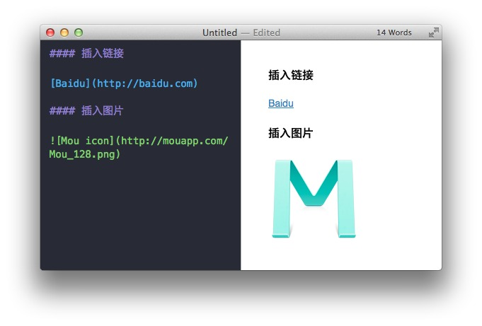
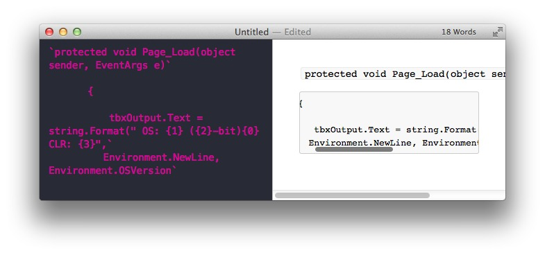
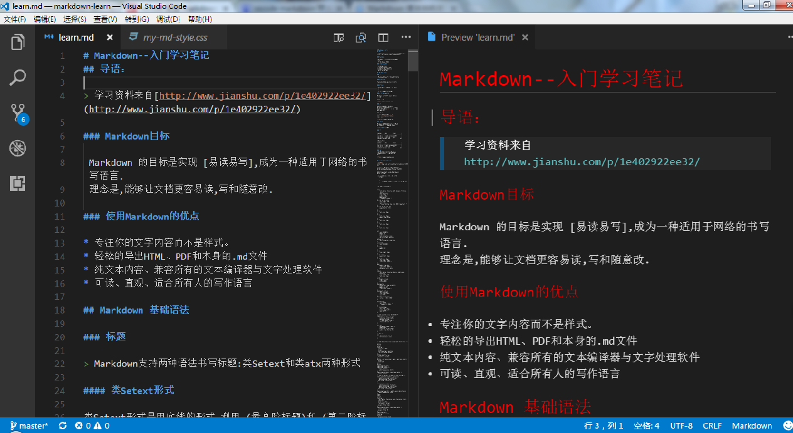

# Markdown--入门学习笔记
## 导语：

> 学习资料来自[http://www.jianshu.com/p/1e402922ee32/](http://www.jianshu.com/p/1e402922ee32/)

### Markdown目标

 Markdown 的目标是实现 [易读易写],成为一种适用于网络的书写语言. 
 理念是,能够让文档更容易读,写和随意改.

### 使用Markdown的优点

* 专注你的文字内容而不是样式。
* 轻松的导出HTML、PDF和本身的.md文件
* 纯文本内容、兼容所有的文本编译器与文字处理软件
* 可读、直观、适合所有人的写作语言

## Markdown 基础语法

### 标题

> Markdown支持两种语法书写标题:类Setext和类atx两种形式

#### 类Setext形式

类Setext形式是用底线的形式,利用=(最高阶标题)和-(第二阶标题)

#### 类Atx形式

 类Atx形式是在行首插入1到6个#,对应到标题 1 到 6 阶，如图：

 

### 区块引用 Blockquotes

Markdown 标记区块引用的是类似 email 中>的引用方式
> 例如这样

书写格式：`> 例如这样`


### 列表

熟悉HTML的同学肯定知道有序列表与无序列表的区别，在Markdown下，列表的显示只需要在文字前加上`-`或`*`即可变为无序列表，有序列表则直接在文字前加`1.` `2.` `3.` 符号并且与文字之间加一个字符的空格

### 图片与链接

插入链接与插入图片的语法很像，区别在一个 `!` 号
图片为： `{ImgCap}{/ImgCap}`
链接为： `[]()` 



### 粗体与斜体

Markdown 的粗体和斜体也非常简单，用一对 `**` 包含一段文本就是粗体的语法，用一对 `*` 包含一段文本就是斜体的语法

例如：**这里是粗体** *这里是斜体*

### 表格

```
|Tables      |Are          |Cool         |
|------------|-------------|-------------|
|col 3 is    |right-aligned|$1600        |
|col 3 is    |centered     |$12          |
|zebrastripes|are neat     |           $1|
```
这样的语法会生成表格如下：

|Tables      |Are          |Cool         |
|------------|-------------|-------------|
|col 3 is    |right-aligned|$1600        |
|col 2 is    |centered     |$12          |
|zebrastripes|are neat     |           $1|

### 代码框

如果你是程序猿，需要在文章里优雅的引用代码框，在Markdown下实现也非常简单，只需要用两个 ` 把中间的代码包裹起来就可以。如图：




## vscode 配置 Markdown 预览

> 引用[崔瑜的专栏](http://blog.csdn.net/cuiy6642/article/details/51595333)

vscode 本身支持 Markdown 语法的文档预览，你只要到应用商店搜索扩展 Auto-Open Markdown Preview 安装就可以，以后你打开 .md 文件右侧就会出现文档预览。

你可以直接使用，也可以通过自己定义 vscode 的 Markdown 显示 css 风格来改变显示效果

> 1.vscode菜单 文件-> 首选项 -> 设置 ->用户设置
    在代码添加：

```
    {
        "markdown.styles": [ "file:///c:/my-md.css" ]
    }
```

> 2.编辑my-md.css 文件内容如下：

```
body{
    font-family: Consolas, 新宋体, Georgia, Palatino, serif;
    color: #CCCCCC;
    line-height: 1;
    padding: 30px;
    margin:auto;
    /* max-width:42em; */
}
h1, h2, h3, h4, h5 {
    font-weight: 400;
    color: red;
    /* border-bottom: 2px solid #999 !important; */
}
h1, h2, h3, h4, h5, p {
    margin-bottom: 24px;
    padding: 0;
}
h1 {
    font-size: 30px;
}
h2 {
    font-size: 24px;
    margin: 24px 0 6px;
}
h3 {
    font-size: 21px;
}
h4 {
    font-size: 18px;
}
h5 {
    font-size: 14px;
}

a {
    color: #61BFC1;
    margin: 0;
    padding: 0;
    text-decoration: none;
    vertical-align: baseline;
}
a:hover {
    text-decoration: underline;
}
a:visited {
    color: #466B6C;
}
ul, ol {
    padding: 0;
    margin: 0;
}
li {
    line-height: 24px;
}
li ul, li ul {
    margin-left: 24px;
}
p, ul, ol {
    font-size: 16px;
    line-height: 24px;
    /*max-width: 540px;*/
}
pre {
    padding: 0px 0px;
    /*max-width: 800px;*/
    white-space: pre-wrap;
    background-color: #FFF;
}
code {
    font-family: Consolas, Monaco, Andale Mono, monospace;
    line-height: 1.5;
    font-size: 13px;
}
aside {
    display: block;
    float: right;
    width: 390px;
}
blockquote {
    border-left:.5em solid #FFF;
    padding: 0 2em;
    margin-left:0;
    /*max-width: 476px;*/
}
blockquote  cite {
    font-size:14px;
    line-height:20px;
    color:#FFF;
}
blockquote cite:before {
    content: '\2014 \00A0';
}

blockquote p {  
    color: #FFF;
    /* max-width: 460px; */
}
hr {
    width: 540px;
    text-align: left;
    margin: 0 auto 0 0;
    color: #FFF;
}

/* Code added by cuiyu 2016-06-03 */
table { 
    border-collapse: collapse; 
    border:1px solid #cad9ea; 
    empty-cells:show; 
    /* table-layout:fixed; */ 
    /* margin:0 auto; */ 
} 

td, th { 
    background-repeat:repeat-x; 
    height:30px; 
    border:1px solid #cad9ea; 
    padding: 0px 5px 0px 5px; 
} 

/* 首行缩进 */ 
p {
    /*text-indent:2em; */
    white-space:pre-wrap;
}


/* Code below this line is copyright Twitter Inc. */

button,
input,
select,
textarea {
  font-size: 100%;
  margin: 0;
  vertical-align: baseline;
  *vertical-align: middle;
}
button, input {
  line-height: normal;
  *overflow: visible;
}
button::-moz-focus-inner, input::-moz-focus-inner {
  border: 0;
  padding: 0;
}
button,
input[type="button"],
input[type="reset"],
input[type="submit"] {
  cursor: pointer;
  -webkit-appearance: button;
}
input[type=checkbox], input[type=radio] {
  cursor: pointer;
}
/* override default chrome & firefox settings */
input:not([type="image"]), textarea {
  -webkit-box-sizing: content-box;
  -moz-box-sizing: content-box;
  box-sizing: content-box;
}

input[type="search"] {
  -webkit-appearance: textfield;
  -webkit-box-sizing: content-box;
  -moz-box-sizing: content-box;
  box-sizing: content-box;
}
input[type="search"]::-webkit-search-decoration {
  -webkit-appearance: none;
}
label,
input,
select,
textarea {
  font-family: "Helvetica Neue", Helvetica, Arial, sans-serif;
  font-size: 13px;
  font-weight: normal;
  line-height: normal;
  margin-bottom: 18px;
}
input[type=checkbox], input[type=radio] {
  cursor: pointer;
  margin-bottom: 0;
}
input[type=text],
input[type=password],
textarea,
select {
  display: inline-block;
  width: 210px;
  padding: 4px;
  font-size: 13px;
  font-weight: normal;
  line-height: 18px;
  height: 18px;
  color: #808080;
  border: 1px solid #ccc;
  -webkit-border-radius: 3px;
  -moz-border-radius: 3px;
  border-radius: 3px;
}
select, input[type=file] {
  height: 27px;
  line-height: 27px;
}
textarea {
  height: auto;
}

/* grey out placeholders */
:-moz-placeholder {
  color: #bfbfbf;
}
::-webkit-input-placeholder {
  color: #bfbfbf;
}

input[type=text],
input[type=password],
select,
textarea {
  -webkit-transition: border linear 0.2s, box-shadow linear 0.2s;
  -moz-transition: border linear 0.2s, box-shadow linear 0.2s;
  transition: border linear 0.2s, box-shadow linear 0.2s;
  -webkit-box-shadow: inset 0 1px 3px rgba(0, 0, 0, 0.1);
  -moz-box-shadow: inset 0 1px 3px rgba(0, 0, 0, 0.1);
  box-shadow: inset 0 1px 3px rgba(0, 0, 0, 0.1);
}
input[type=text]:focus, input[type=password]:focus, textarea:focus {
  outline: none;
  border-color: rgba(82, 168, 236, 0.8);
  -webkit-box-shadow: inset 0 1px 3px rgba(0, 0, 0, 0.1), 0 0 8px rgba(82, 168, 236, 0.6);
  -moz-box-shadow: inset 0 1px 3px rgba(0, 0, 0, 0.1), 0 0 8px rgba(82, 168, 236, 0.6);
  box-shadow: inset 0 1px 3px rgba(0, 0, 0, 0.1), 0 0 8px rgba(82, 168, 236, 0.6);
}

/* buttons */
button {
  display: inline-block;
  padding: 4px 14px;
  font-family: "Helvetica Neue", Helvetica, Arial, sans-serif;
  font-size: 13px;
  line-height: 18px;
  -webkit-border-radius: 4px;
  -moz-border-radius: 4px;
  border-radius: 4px;
  -webkit-box-shadow: inset 0 1px 0 rgba(255, 255, 255, 0.2), 0 1px 2px rgba(0, 0, 0, 0.05);
  -moz-box-shadow: inset 0 1px 0 rgba(255, 255, 255, 0.2), 0 1px 2px rgba(0, 0, 0, 0.05);
  box-shadow: inset 0 1px 0 rgba(255, 255, 255, 0.2), 0 1px 2px rgba(0, 0, 0, 0.05);
  background-color: #0064cd;
  background-repeat: repeat-x;
  background-image: -khtml-gradient(linear, left top, left bottom, from(#049cdb), to(#0064cd));
  background-image: -moz-linear-gradient(top, #049cdb, #0064cd);
  background-image: -ms-linear-gradient(top, #049cdb, #0064cd);
  background-image: -webkit-gradient(linear, left top, left bottom, color-stop(0%, #049cdb), color-stop(100%, #0064cd));
  background-image: -webkit-linear-gradient(top, #049cdb, #0064cd);
  background-image: -o-linear-gradient(top, #049cdb, #0064cd);
  background-image: linear-gradient(top, #049cdb, #0064cd);
  color: #fff;
  text-shadow: 0 -1px 0 rgba(0, 0, 0, 0.25);
  border: 1px solid #004b9a;
  border-bottom-color: #003f81;
  -webkit-transition: 0.1s linear all;
  -moz-transition: 0.1s linear all;
  transition: 0.1s linear all;
  border-color: #0064cd #0064cd #003f81;
  border-color: rgba(0, 0, 0, 0.1) rgba(0, 0, 0, 0.1) rgba(0, 0, 0, 0.25);
}
button:hover {
  color: #fff;
  background-position: 0 -15px;
  text-decoration: none;
}
button:active {
  -webkit-box-shadow: inset 0 3px 7px rgba(0, 0, 0, 0.15), 0 1px 2px rgba(0, 0, 0, 0.05);
  -moz-box-shadow: inset 0 3px 7px rgba(0, 0, 0, 0.15), 0 1px 2px rgba(0, 0, 0, 0.05);
  box-shadow: inset 0 3px 7px rgba(0, 0, 0, 0.15), 0 1px 2px rgba(0, 0, 0, 0.05);
}
button::-moz-focus-inner {
  padding: 0;
  border: 0;
}
```

效果如下：
